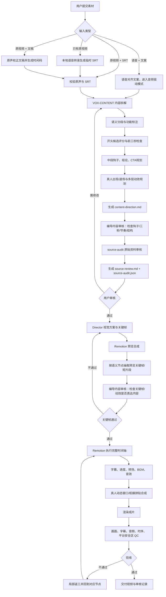

# Vox 剪辑端到端流程图

## 各模块职责

| 模块 | 负责什么 | 主要产物 |
|---|---|---|
| 输入路由 | 判断素材组合，生成或校验时间字幕 | 临时 SRT / 对齐记录 |
| VOX-CONTENT | 理解内容并规划钩子、节奏、真人和动效 | `content-direction.md` |
| source-audit | 核对来源、时间、事实、素材指纹并等待批准 | `source-review.md`、`source-audit.json` |
| Director | 把已确认语义转成画面、组件和运动方案 | 视觉方案、关键帧 |
| Remotion 执行 | 合成真人、拼贴、字幕、动画和声音 | 渲染视频 |
| QC | 检查可读性、同步、音量、画面和安全区 | 验收记录 |
