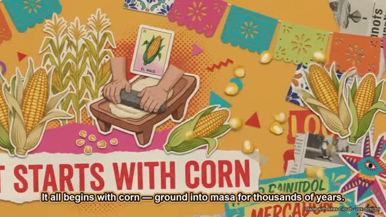
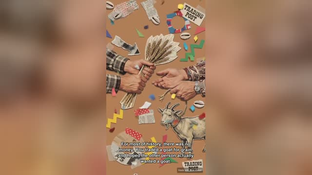
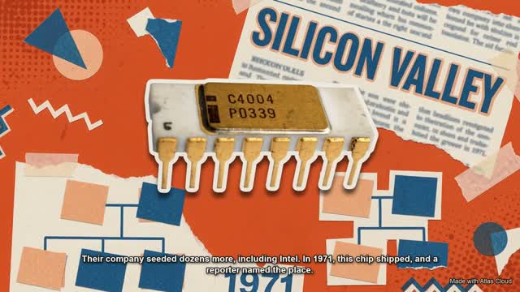

<p align="right"><a href="README.md">English</a> · <b>简体中文</b></p>

# 🎬 Vox Director(拼贴动效导演)

**一个选题进,一条成片出——脚本、拼贴关键帧、动效、旁白、配乐、字幕,全流程自动化的 Vox 风格拼贴讲解/广告视频。**

一个**通用 agent 技能**,后端全跑 [Atlas Cloud](https://www.atlascloud.ai/?utm_source=github&utm_campaign=vox_director) API、本地用 `ffmpeg` 合成,任何编码 agent(Claude Code、Codex 等)都能用。你给一句话选题,它给你一个 `mp4`。

  

<div align="center">

https://github.com/user-attachments/assets/ed08d230-7bcb-4b48-a17d-23c079208f9f

<b>▶《中华文明的变迁》· 30 秒</b>

</div>

<table>
  <tr>
    <td width="25%"><a href="https://github.com/user-attachments/assets/216cd62f-6314-456c-94cf-1090b8559a22"></a></td>
    <td width="25%"><a href="https://github.com/user-attachments/assets/561788b1-5615-4828-b3f8-b24ae5ad7bcd"></a></td>
    <td width="25%"><a href="https://github.com/user-attachments/assets/f69f072f-f50a-41ba-9e66-7ed0aae4ddc0"></a></td>
    <td width="25%"><a href="https://github.com/user-attachments/assets/b9ff526f-577f-4acb-aafe-a2519a9b7c1c"></a></td>
  </tr>
  <tr>
    <td align="center"><sub>足球如何征服世界 · 60 秒</sub></td>
    <td align="center"><sub>墨西哥街头美食 · 60 秒</sub></td>
    <td align="center"><sub>货币简史 · 60 秒</sub></td>
    <td align="center"><sub>硅谷简史 · 60 秒</sub></td>
  </tr>
</table>

<p align="center"><sub><em>▶ 更多影片 —— 点击任意封面播放</em></sub></p>

---

## 这是什么

风格是 Vox 讲解片带火的现代编辑感**纸质拼贴**:手撕纸片、毛边、胶带、半调网点、报纸剪贴、每一拍一块大胆平涂色、大号剪纸标题——再配上动效、旁白、配乐和字幕,让整张海报活过来。

## 工作原理

一个选题依次流过每个阶段一个脚本,全程由每个项目一份 `beats.json` 驱动:

```
选题
  │
  ├─ 1. 分镜脚本   选叙事弧线 → 写 beats.json          ◀── 决策点 1:你确认分镜脚本
  ├─ 2. 风格试片   同一拍渲成 3–4 种主题               ◀── 决策点 2:你看图挑风格
  ├─ 3. 关键帧     每拍一张拼贴海报   (nano-banana-2)
  ├─ 4. 动效       让每张海报动起来   (gemini-omni-flash 图生视频)
  ├─ 5. 旁白+配乐  统一旁白 (xai/tts) + 背景乐 (minimax/music)
  ├─ 6. 合成       ffmpeg:拼接、配乐在旁白下自动闪避、烧字幕+水印
  └─ final.mp4
```

上面这条是 **B-roll**——一个选题进去,画面全靠生成。另外两种输入形态复用同一套引擎:

- **A-roll——你已经有一段口播视频。** 它会被 ASR 自动切成段,再整段套上拼贴风格,真人的脸、口型、手势逐帧保留(`gemini-omni-flash/video-edit`,失败自动重试 `seedance-2.0/reference-to-video`)。
- **C-roll——你只有一张静态照片**(自拍、产品图)。主体被抠成摄影质感的贴纸——绝不重绘——每一段的海报围着它生成(`nano-banana-2/edit`)。旁白还能克隆成主体本人的声音。

两个关键理念决定成败,技能就是围绕它们搭的:

1. **风格诞生在生图这一步。** 每一拍是一张成品拼贴*海报*,所有拼贴基因(撕纸、剪纸、网点、标题文字)都长在这张图里——图不够拼贴,后面再怎么救也救不回来。
2. **动效是后加的。** 默认由 AI 视频模型把整张海报动起来(「活海报」路径);要那种戏剧化的**零件逐个飞入拼合**,可选的本地关键帧引擎会把海报拆成零件逐帧驱动(无内容审核、像素级精确,尤其适合真人)。

两个人工决策点让你始终掌控(确认分镜脚本、挑风格),其余全自动。

## 模型(已在 Atlas Cloud 上验证)

| 用途 | 模型 |
|---|---|
| 关键帧 / 拼贴海报 | `google/nano-banana-2/text-to-image` |
| 动效(非真人内容) | `google/gemini-omni-flash/image-to-video` |
| 动效(**真人 / 品牌**) | `kwaivgi/kling-video-o3-pro/image-to-video` |
| 口播视频转拼贴(A-roll) | `google/gemini-omni-flash/video-edit` |
| 照片锚进拼贴(C-roll) | `google/nano-banana-2/edit` |
| 旁白 | `xai/tts-v1` |
| 用真人本人的声音念旁白 | `bytedance/seed-audio-1.0`(声音克隆) |
| 配乐 | `minimax/music-2.6` |
| 抠素材(高级路径) | `youchuan/v8.1/remove-background` |

模型 ID 会变——技能运行前会先从 `GET https://api.atlascloud.ai/api/v1/models` 拉取最新列表。

## 安装

这是一个**通用 agent 技能**——任何能读工作流、跑脚本的编码 agent 都能用(Claude Code、Codex 等)。Claude Code 会自动把它识别成 skill;其他 agent 读 [`AGENTS.md`](AGENTS.md) → [`SKILL.md`](SKILL.md)。

**方式 A —— 从本仓库:**
```bash
git clone https://github.com/Alisa0808/vox-director.git ~/.claude/skills/vox-director
```

**方式 B —— 用打包好的技能文件:** 从上游仓库下载 [`vox-director.skill`](https://github.com/Alisa0808/vox-director/blob/main/vox-director.skill)，在你的 Claude 技能界面里安装。

然后设置 Atlas Cloud API key(在 [atlascloud.ai/console/api-keys](https://www.atlascloud.ai/console/api-keys?utm_source=github&utm_campaign=vox_director) 获取):
```bash
export ATLASCLOUD_API_KEY="sk-..."
```

## 快速开始

装好技能后,直接跟你的编码 agent 说:

> *「做一条 Vox 风格的拼贴视频,介绍墨西哥街头美食——全英文,16:9,15 秒。」*

agent 会先起草分镜脚本给你确认,再跑一轮风格试片让你挑,然后生成关键帧 → 动效 → 旁白 → 配乐,合成 `out/<项目>/final.mp4`。

## 环境要求

- 一个**编码 agent**——Claude Code、Codex 或类似工具
- **Atlas Cloud** API key
- **ffmpeg** + **ffprobe**(`brew install ffmpeg`)
- **Python 3** + **Pillow**(`pip install pillow`)——用于字幕/水印叠加

## 目录结构

```
SKILL.md              技能本体(英文)——agent 遵循的工作流
SKILL.zh.md           同一技能的中文版
AGENTS.md             非 Claude agent(Codex 等)的入口
references/           创意引擎
  prompt-guide.md       画面/LOOK 层:提示词结构 + 词库 + 9 套主题预设
  beat-layer.md         14 种叙事弧线 + 钩子/节奏 + 镜头模式
  voices.md             xai/tts 音色表 —— 按语种/调性挑 voice_id
  models-and-gotchas.md 每一个 API / ffmpeg 坑,都已填平
  local-engine.md       高级的元素级动效引擎
scripts/              每个管线阶段一个脚本
examples/             可直接跑的 beats.json 示例
assets/               样片
```

## 致谢

作者 **[@alisaqqt](https://x.com/alisaqqt)** —— 关注我看更多 agent skill 实验。

灵感来自 **[Stav Zilber](https://x.com/StavZilber)**、**[rom1trs](https://x.com/rom1trs)**、**[Higgsfield](https://x.com/higgsfield_ai)** 的拼贴广告工作流,以及 **[Vox](https://www.vox.com)** 的讲解片视觉语言。

全流程基于 **[Atlas Cloud](https://www.atlascloud.ai/?utm_source=github&utm_campaign=vox_director)** 构建——一个提示词,一条成片。

## 许可

[MIT](LICENSE) © 2026 Alisa Qian

## 友情链接

**[LINUX DO](https://linux.do)** —— 一个开放、友善的开发者社区,大家在这里分享与学习。
